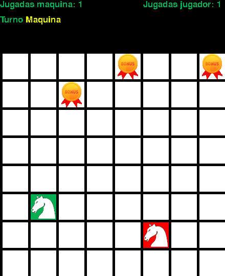
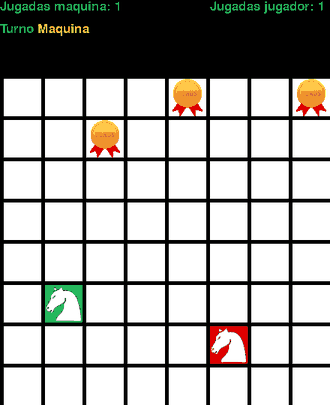

# IA_project2

Coursework — Artificial Intelligence, Universidad del Valle (2024).

Depth-limited **minimax** over a game tree with a heuristic utility function,
playable through a pygame interface. The game tree is built up to a depth
limit (`crearArbol`) and walked back up (`recorrerMinimax`) to pick the move,
so the depth limit and the heuristic are what decide how well the machine
plays.

## The game

**War Horses**, on an 8×8 board. Two knights — yours in green, the machine's in
red — jump the way a chess knight does. Every square a knight leaves stays
painted in its colour, and the three bonus squares paint their four neighbours
at once. The game ends when neither knight has anywhere left to jump, and
whoever painted more squares wins. Knights, bonuses and starting squares are
placed at random each time.



## The machine playing

The menu's three levels are three depth limits — `DIFICULTAD = [2, 4, 6]`.
These are three full games on the **same** board, against the **same** scripted
opponent, one per level:

| Beginner — depth 2 | Amateur — depth 4 | Expert — depth 6 |
| --- | --- | --- |
|  |  |  |
| 33 turns · 39 – 16 · 3 of 3 bonuses | 24 turns · 28 – 25 · 2 of 3 bonuses | 18 turns · 23 – 19 · 2 of 3 bonuses |

The machine wins all three, and the **shallowest** search wins by the widest
margin: at depth 2 it takes all three bonus squares and paints 39 to 16, while
at depth 6 it closes the game out in half the turns and wins 23 to 19.

That is worth stating plainly rather than dressing up. **These are recordings,
not a benchmark**: one game per level from a single seed, against a stand-in
opponent that takes whichever move paints the most squares right now and never
looks at the reply. Against that opponent the extra depth buys nothing, and the
scores are not comparable across levels anyway, because a game that ends in 18
turns has fewer squares to hand out than one that ends in 33. Whether the
heuristic actually rewards looking further ahead is a question this repository
does not answer — measuring it would mean playing many games from many seeds
and pitting the depths against each other.

## Running it

```bash
pip install -r requirements.txt
python Interfaz.py
```

Any library you add belongs in `requirements.txt`.

## Regenerating the images

The GIFs and the numbers above come from actual games, played and rendered
off-screen by:

```bash
pip install pillow
python tools/record_demo.py
```
